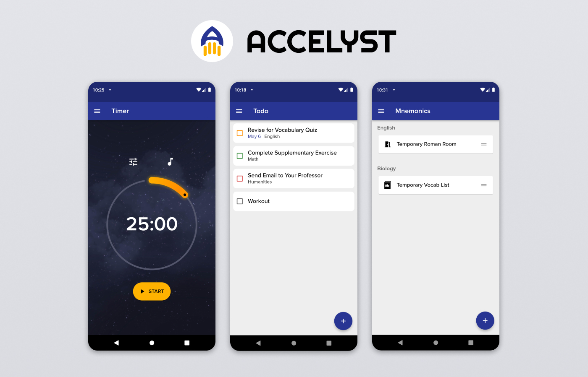

# COMP4521 Group 4 - Accelyst

## About

Accelyst is an all-in-one study companion app that helps students organize their tasks, stay focused while studying, and practice memorization techniques.



## Development

1. Download project dependencies:
   ```
   flutter pub get
   ```
2. Run this command in Terminal at the project root and leave it running in the **background**.
   ```
   flutter pub run build_runner watch
   ```
   This command automatically runs the code generator as required by the [json_serializable](https://pub.dev/packages/json_serializable) package to generate to/from JSON code for model classes.
3. Open your Android emulator.
4. In a **new Terminal window**, run this command to start the Flutter app:
   ```
   flutter run
   ```
